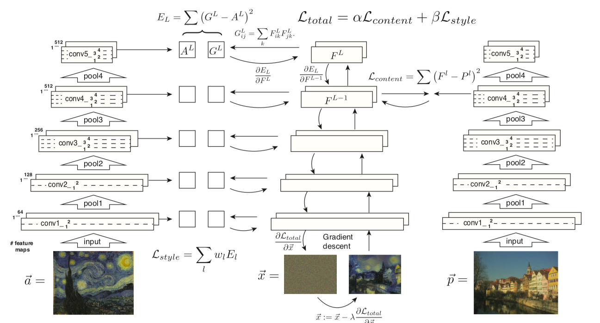
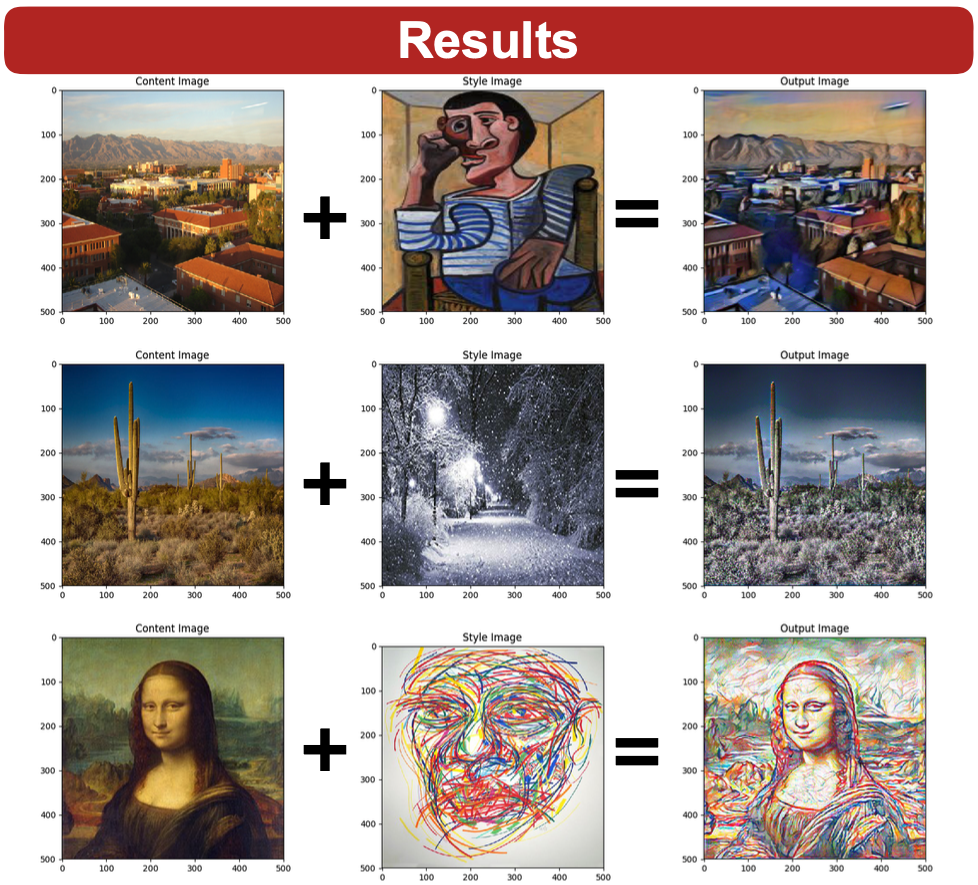
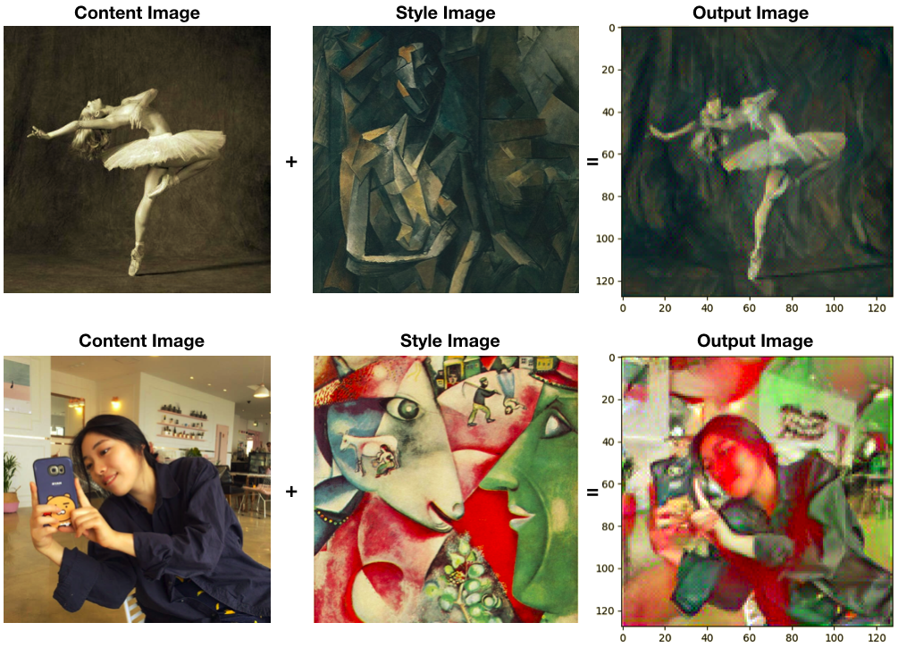
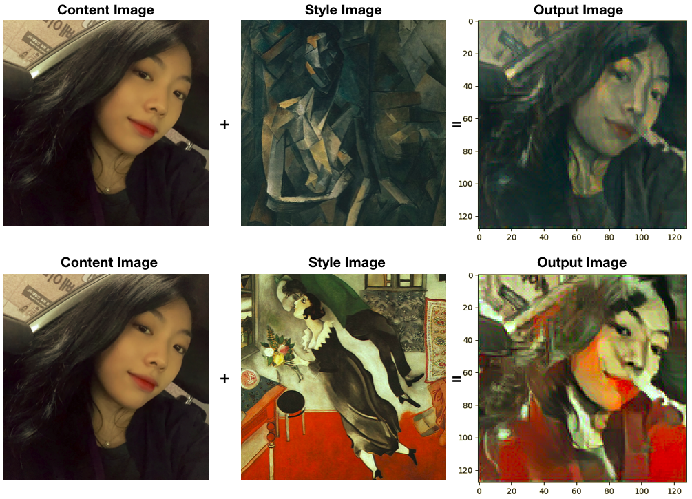
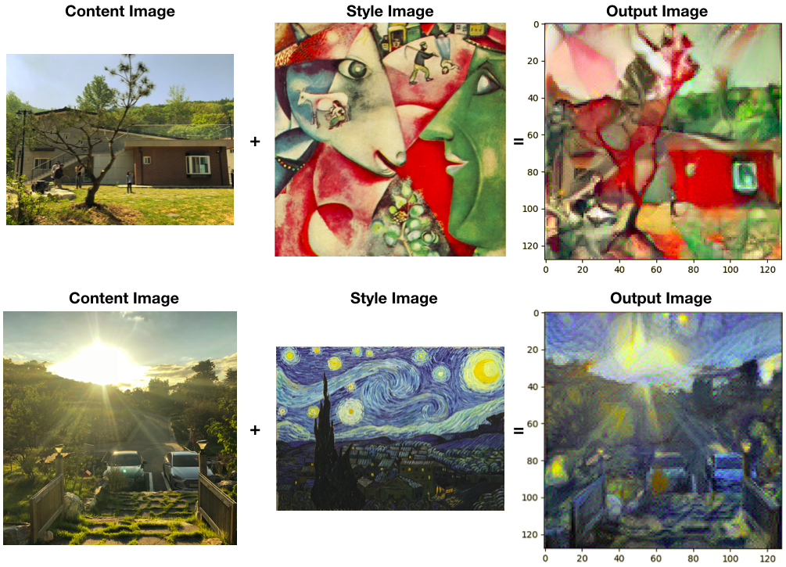
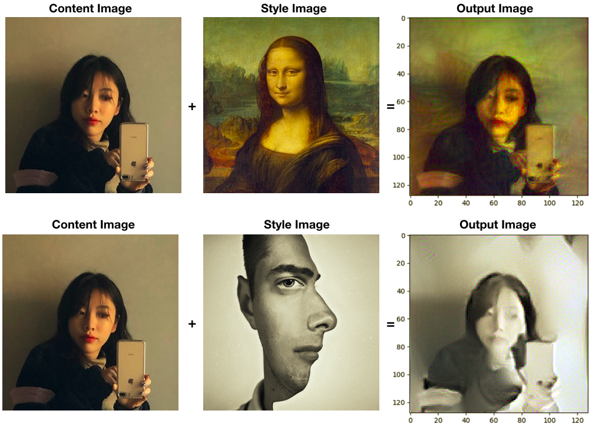

# Neural-Style-Transfer-pytorch

Pytorch implementation of [Image Style Transfer Using Convolutional Neural Networks](https://www.cv-foundation.org/openaccess/content_cvpr_2016/papers/Gatys_Image_Style_Transfer_CVPR_2016_paper.pdf). It is my first paper implementation so it would be quite awkward. I recommend you use it only for a reference. The [Tutorial Code](https://pytorch.org/tutorials/advanced/neural_style_tutorial.html) was very helpful for me to complete my code.

## To-do

- [x] Image Style Transfer Using Convolutional Neural Networks (2016) [[Paper]](https://www.cv-foundation.org/openaccess/content_cvpr_2016/papers/Gatys_Image_Style_Transfer_CVPR_2016_paper.pdf)
- [ ] Combining Markov Random Fields and Convolutional Neural Networks for Image Synthesis (2016) [[Paper]](https://www.cv-foundation.org/openaccess/content_cvpr_2016/papers/Li_Combining_Markov_Random_CVPR_2016_paper.pdf)
- [ ] Perceptual Losses for Real-Time Style Transfer and Super-Resolution (2016) [[Paper]](https://arxiv.org/pdf/1603.08155.pdf)
- [ ] Fast Patch-based Style Transfer of Arbitrary Style (2016) [[Paper]](https://arxiv.org/pdf/1612.04337.pdf)
- [ ] A Learned Representation for Artistic Style (2017) [[Paper]](https://arxiv.org/pdf/1610.07629.pdf)
- [ ] Real-Time Neural Style Transfer for Videos (2017) [[Paper]](http://openaccess.thecvf.com/content_cvpr_2017/papers/Huang_Real-Time_Neural_Style_CVPR_2017_paper.pdf)
- [ ] Stereoscopic Neural Style Transfer (2018) [[Paper]](https://arxiv.org/pdf/1802.10591.pdf)
- [ ] Separating Style and Content for Generalized Style Transfer (2018) [[Paper]](https://arxiv.org/pdf/1711.06454.pdf)

## Usage

To train a model with images you want to merge:

    $ python train.py --c_weight=1 \
                      --s_weight=100000 \
                      --content_img='images/dancing.jpg' \
                      --style_img='images/picasso.jpg' \
                      --size=128 --steps=300

To see all training options, run:

    $ python train.py --help

which will print:

    usage: train.py [-h] [--content_img CONTENT_IMG] [--style_img STYLE_IMG]
                    [--size SIZE] [--steps STEPS] [--c_weight C_WEIGHT]
                    [--s_weight S_WEIGHT]

    optional arguments:
    -h, --help                  show this help message and exit
    --content_img CONTENT_IMG
    --style_img STYLE_IMG
    --size SIZE                 if you want to get more clear pictures, increase the
                                size
    --steps STEPS
    --c_weight C_WEIGHT         weighting factor for content reconstruction
    --s_weight S_WEIGHT         weighting factor for style reconstruction

## Result

[Poster Presentation](https://github.com/symoon94/Neural-Style-Transfer-pytorch/blob/master/assets/soo_poster.pdf)

## Author

Sooyoung Moon / [@symoon94](https://www.facebook.com/msy0128)
